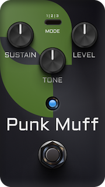

# PunkMuff
 

## Introduction
This is a simple vst3/au distortion plugin made with [JUCE](https://juce.com/) that I built to introduce myself in the JUCE framework. I used Machine Learning to train a model based on the [Big Muff Pi pedal](https://www.electrosmash.com/big-muff-pi-analysis), then added the `MODE` parameter to emulate the frequency response of other iterations of this pedal.

Special thanks to [Keith Bloemer](https://github.com/GuitarML) for his work and documentation on [Neural Networks for Real-Time Audio](https://medium.com/nerd-for-tech/neural-networks-for-real-time-audio-introduction-ed5d575dc341). 

## Features
- **Sustain**: Sets the gain before the clipping processing.
- **Tone & Mode**: Adjust the frequency response after the clipping. The `mode` emulates the EQ curves of the following pedals:
    - Mode 1: Big Muff Pi.
    - Mode 2: Elk Sustainer.
    - Mode 3: Custom modification.
- **Level**: Adjust the output gain.

## Interesting links

* [Big Muff Pi Analysis](https://www.electrosmash.com/big-muff-pi-analysis)
* [TS-9 cloned with Machine Learning](https://github.com/GuitarML/TS-M1N3/tree/main)
* [RTNeural](https://github.com/jatinchowdhury18/RTNeural)
